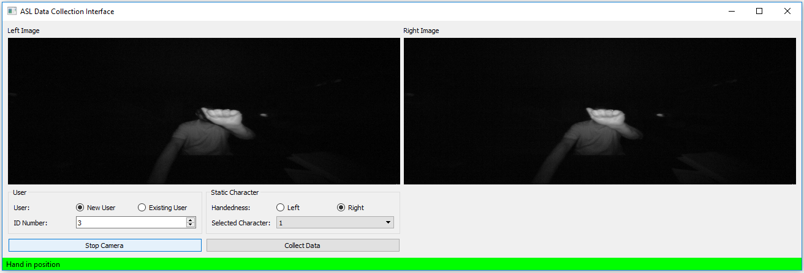
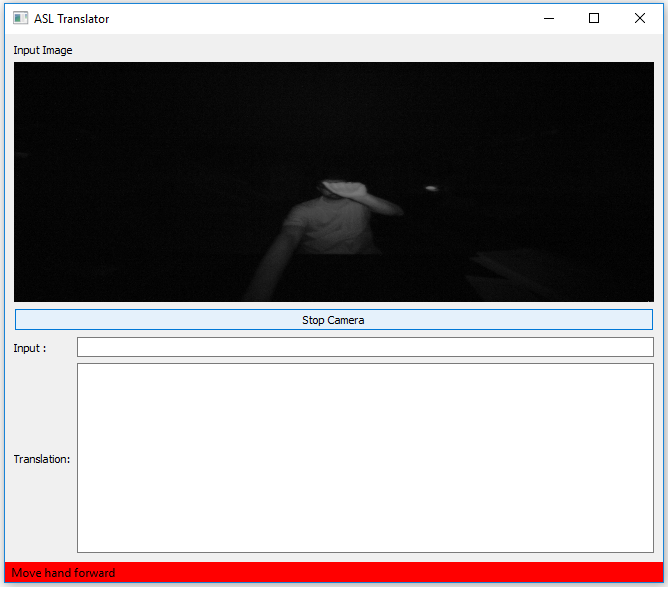

# ASL Translator
A project to 
  * collect ASL (American Sign Language) static gestures through the use of the Leap Motion Sensor. 
  * translate ASL gestures into text with the use of a machine learned model from data collection

#### Features:
Currently reads files of the following formats: 
  * Excel 
  * comma delimited or white-space delimited 

#### Includes:
  * One RandomForest model created from data collected from 6 users 
  * leap_utils.py: 
	  * Some utilities for working with leap motion data 

Built-in Graph Generator for plotting data  
Merge tool for merging multiple dataframes
Group-by tool for selecting subsets of data

#### Requirements:
Python 2.7 
PyQt4 or PyQt5 
Leap Motion Sensor 
Leap Motion Sensor SDK 

#### Screenshots
ASL_dataCollectGUI 
  * Modify lines 9 and 10 for path to SDK (LeapDeveloperKit_3.2.0+45899_win\LeapDeveloperKit_3.2.0+45899_win\LeapSDK\lib) 
  * Modify line 157 to update output paths for data collection 
 

ASL_TranslatorGUI 
  * Modify lines 9 and 10 for path to SDK (LeapDeveloperKit_3.2.0+45899_win\LeapDeveloperKit_3.2.0+45899_win\LeapSDK\lib) 
  * Modify line 54 to update model path 
 